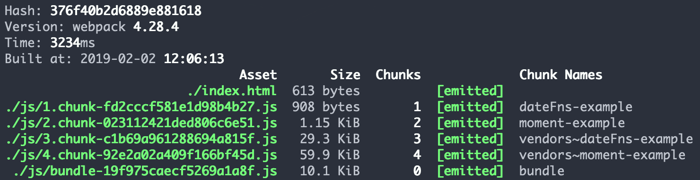

# date-fns vs moment

* https://date-fns.org/
* https://momentjs.com/

Date-fns is not creating new object that will hold date. Instead it is operating on build in Date objects of js.
This is why each method is not only separated, but also encouraged to use separately.

## bundle results (all minified)

